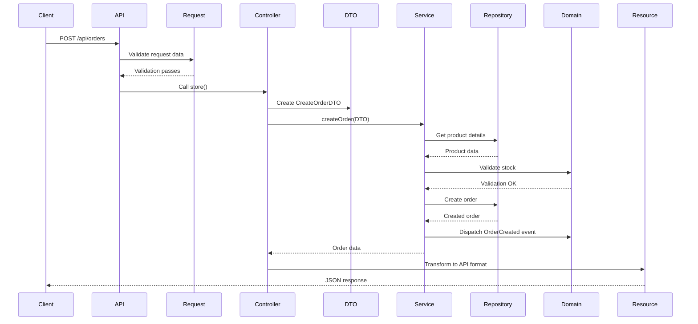

# Laravel E-Commerce System - Architecture Documentation

## Table of Contents

1. [Project Overview](#project-overview)
2. [Domain-Driven Design (DDD) Fundamentals](#domain-driven-design-ddd-fundamentals)
3. [Project Structure](#project-structure)
4. [Layer-by-Layer Explanation](#layer-by-layer-explanation)
5. [Code Examples](#code-examples)
6. [API Endpoints](#api-endpoints)
7. [Database Schema](#database-schema)
8. [Frontend Architecture](#frontend-architecture)
9. [Running the Project](#running-the-project)

---

## Project Overview

This is a full-stack e-commerce management system built with:

- **Backend:** Laravel 11 with Domain-Driven Design (DDD) architecture
- **Frontend:** React 19 with Vite and Bootstrap 5
- **Database:** MySQL 8.0
- **API:** RESTful JSON API

**GitHub Repository:** https://github.com/MichaelRafaillo/laravel-order-product-system

---

## Domain-Driven Design (DDD) Fundamentals

### What is DDD?

Domain-Driven Design is an approach to software development that focuses on the core domain and domain logic. It emphasizes collaboration between technical experts and domain experts to create a shared understanding of the business problem.

### Key DDD Concepts Used in This Project

| Concept | Description | Example in Project |
|---------|-------------|-------------------|
| **Domain** | The business logic and rules | E-commerce operations (Orders, Products, Customers) |
| **Bounded Context** | A boundary within which a domain model applies | Each module (Products, Orders, Customers) |
| **Entities** | Objects with a unique identity | `Order`, `Product`, `Customer` |
| **Value Objects** | Objects without identity, defined by attributes | `Money`, `OrderStatus`, `SKU` |
| **Aggregates** | Clusters of related objects | `Order` contains `OrderItems` |
| **Repositories** | Interfaces for data access | `OrderRepositoryInterface` |
| **Services** | Business logic that doesn't fit in entities | `OrderService`, `ProductService` |
| **DTOs** | Data Transfer Objects | `CreateOrderDTO`, `UpdateProductDTO` |

---

## Project Structure

```
laravel-order-product-system/
├── app/
│   ├── Application/          # Application Layer
│   │   ├── DTOs/            # Data Transfer Objects
│   │   ├── Interfaces/       # Service & Repository Interfaces
│   │   └── Services/         # Application Services
│   ├── Domain/               # Domain Layer (Business Logic)
│   │   ├── Entities/         # Domain Entities
│   │   ├── Events/           # Domain Events
│   │   ├── Exceptions/       # Domain Exceptions
│   │   └── ValueObjects/     # Value Objects
│   ├── Infrastructure/      # Infrastructure Layer
│   │   └── Repositories/     # Repository Implementations
│   ├── Http/
│   │   ├── Controllers/      # API Controllers
│   │   ├── Requests/         # Form Requests (Validation)
│   │   └── Resources/        # API Response Transformers
│   ├── Models/              # Eloquent Models
│   └── Providers/           # Service Providers
├── database/
│   ├── migrations/          # Database Migrations
│   └── seeders/             # Database Seeders
├── frontend/                 # React Frontend
│   ├── src/
│   │   ├── components/       # Reusable Components
│   │   ├── pages/           # Page Components
│   │   ├── services/         # API Service Layer
│   │   └── App.jsx          # Main App with Routing
│   └── package.json
├── routes/                   # Route Definitions
│   ├── api.php              # API Routes
│   └── web.php              # Web Routes
└── config/                   # Configuration Files
```

---

## Layer-by-Layer Explanation

### 1. Domain Layer (Core Business Logic)

This is the heart of the application. It contains:

#### Entities
```php
// app/Models/Product.php
namespace App\Models;

class Product extends Model
{
    protected $fillable = [
        'name', 'description', 'price', 
        'stock_quantity', 'sku', 'is_active'
    ];
}
```

#### Value Objects
```php
// app/Domain/ValueObjects/Money.php
namespace App\Domain\ValueObjects;

class Money
{
    public function __construct(
        public readonly float $amount,
        public readonly string $currency = 'USD'
    ) {}
    
    public function formatted(): string
    {
        return number_format($this->amount, 2) . ' ' . $this->currency;
    }
}
```

#### Domain Events
```php
// app/Domain/Events/OrderCreated.php
namespace App\Domain\Events;

class OrderCreated
{
    public function __construct(
        public readonly int $orderId,
        public readonly int $customerId,
        public readonly float $totalAmount
    ) {}
}
```

#### Domain Exceptions
```php
// app/Domain/Exceptions/InsufficientStockException.php
namespace App\Domain\Exceptions;

class InsufficientStockException extends DomainException
{
    public function __construct(int $productId, int $requested, int $available)
    {
        parent::__construct(
            "Insufficient stock for product {$productId}. " .
            "Requested: {$requested}, Available: {$available}"
        );
    }
}
```

---

### 2. Application Layer (Use Cases)

This layer coordinates the domain layer to perform specific tasks.

#### DTOs (Data Transfer Objects)
```php
// app/Application/DTOs/CreateOrderDTO.php
namespace App\Application\DTOs;

class CreateOrderDTO
{
    public function __construct(
        public readonly int $customerId,
        public readonly array $items, // [{product_id, quantity}]
        public readonly ?string $notes = null
    ) {}
}
```

#### Service Interfaces
```php
// app/Application/Interfaces/Services/OrderServiceInterface.php
namespace App\Application\Interfaces\Services;

interface OrderServiceInterface
{
    public function createOrder(CreateOrderDTO $data): array;
    public function updateStatus(int $orderId, string $status): array;
    public function cancelOrder(int $orderId): array;
    public function addItem(int $orderId, AddOrderItemDTO $data): array;
}
```

#### Service Implementations
```php
// app/Application/Services/OrderService.php
namespace App\Application\Services;

class OrderService implements OrderServiceInterface
{
    public function __construct(
        private OrderRepositoryInterface $orders,
        private ProductRepositoryInterface $products
    ) {}
    
    public function createOrder(CreateOrderDTO $data): array
    {
        // 1. Validate all products exist and have sufficient stock
        // 2. Calculate total amount
        // 3. Create order with items
        // 4. Dispatch domain events
        // 5. Return created order
    }
}
```

---

### 3. Infrastructure Layer (Data Access)

Implements the interfaces defined in the application layer.

#### Repository Implementation
```php
// app/Infrastructure/Repositories/OrderRepository.php
namespace App\Infrastructure\Repositories;

class OrderRepository implements OrderRepositoryInterface
{
    public function __construct(
        private Order $model,
        private OrderItem $items
    ) {}
    
    public function create(array $data): Order
    {
        return $this->model->create($data);
    }
    
    public function addItem(int $orderId, array $itemData): OrderItem
    {
        // Create order item and update order total
    }
}
```

---

### 4. Presentation Layer (API Controllers)

HTTP entry points that delegate to application services.

```php
// app/Http/Controllers/Api/OrderController.php
namespace App\Http\Controllers\Api;

class OrderController extends Controller
{
    public function __construct(
        private OrderService $orderService
    ) {}
    
    public function index(): JsonResponse
    {
        $orders = $this->orderService->getAllOrders();
        return OrderResource::collection($orders);
    }
    
    public function store(StoreOrderRequest $request): JsonResponse
    {
        $dto = new CreateOrderDTO(
            customerId: $request->input('customer_id'),
            items: $request->input('items'),
            notes: $request->input('notes')
        );
        
        $order = $this->orderService->createOrder($dto);
        
        return response()->json([
            'success' => true,
            'data' => new OrderResource($order),
            'message' => 'Order created successfully'
        ], 201);
    }
}
```

---

## Code Examples

### Example 1: Creating an Order (Full Flow)



### Example 2: Updating Order Status

```php
// Frontend API call
const updateOrderStatus = async (orderId, status) => {
  await axios.put(`/api/orders/${orderId}/status`, { status });
};

// Backend Controller
public function updateStatus(Request $request, int $id): JsonResponse
{
    $validated = $request->validate([
        'status' => 'required|in:pending,processing,completed,cancelled,refunded'
    ]);
    
    $order = $this->orderService->updateStatus($id, $validated['status']);
    
    return response()->json([
        'success' => true,
        'data' => new OrderResource($order),
        'message' => 'Order status updated'
    ]);
}
```

---

## API Endpoints

### Products

| Method | Endpoint | Description |
|--------|----------|-------------|
| GET | `/api/products` | List all products |
| GET | `/api/products/{id}` | Get single product |
| POST | `/api/products` | Create product |
| PUT | `/api/products/{id}` | Update product |
| DELETE | `/api/products/{id}` | Delete product |
| GET | `/api/products/search?q=` | Search products |

### Orders

| Method | Endpoint | Description |
|--------|----------|-------------|
| GET | `/api/orders` | List all orders |
| GET | `/api/orders/{id}` | Get single order |
| POST | `/api/orders` | Create order |
| PUT | `/api/orders/{id}/status` | Update order status |
| POST | `/api/orders/{id}/cancel` | Cancel order |
| DELETE | `/api/orders/{id}` | Delete order |
| GET | `/api/orders/status/{status}` | Filter by status |
| GET | `/api/orders/customer/{customerId}` | Get customer orders |
| POST | `/api/orders/{id}/items` | Add order item |
| PUT | `/api/orders/{id}/items/{itemId}` | Update item quantity |
| DELETE | `/api/orders/{id}/items/{itemId}` | Remove order item |
| POST | `/api/orders/{id}/recalculate` | Recalculate total |

### Customers

| Method | Endpoint | Description |
|--------|----------|-------------|
| GET | `/api/customers` | List all customers |
| GET | `/api/customers/{id}` | Get single customer |
| POST | `/api/customers` | Create customer |
| PUT | `/api/customers/{id}` | Update customer |
| DELETE | `/api/customers/{id}` | Delete customer |
| GET | `/api/customers/search?q=` | Search customers |

---

## Database Schema

### Products Table
```sql
CREATE TABLE products (
    id BIGINT UNSIGNED AUTO_INCREMENT PRIMARY KEY,
    name VARCHAR(255) NOT NULL,
    description TEXT,
    price DECIMAL(10,2) NOT NULL,
    stock_quantity INT NOT NULL DEFAULT 0,
    sku VARCHAR(100) UNIQUE NOT NULL,
    is_active BOOLEAN DEFAULT TRUE,
    created_at TIMESTAMP,
    updated_at TIMESTAMP
);
```

### Orders Table
```sql
CREATE TABLE orders (
    id BIGINT UNSIGNED AUTO_INCREMENT PRIMARY KEY,
    order_number VARCHAR(50) UNIQUE NOT NULL,
    customer_id BIGINT UNSIGNED NOT NULL,
    status ENUM('pending','processing','completed','cancelled','refunded'),
    total_amount DECIMAL(10,2) NOT NULL,
    notes TEXT,
    created_at TIMESTAMP,
    updated_at TIMESTAMP,
    deleted_at TIMESTAMP,
    FOREIGN KEY (customer_id) REFERENCES users(id)
);
```

### Order Items Table
```sql
CREATE TABLE order_items (
    id BIGINT UNSIGNED AUTO_INCREMENT PRIMARY KEY,
    order_id BIGINT UNSIGNED NOT NULL,
    product_id BIGINT UNSIGNED NOT NULL,
    quantity INT NOT NULL,
    unit_price DECIMAL(10,2) NOT NULL,
    subtotal DECIMAL(10,2) NOT NULL,
    created_at TIMESTAMP,
    updated_at TIMESTAMP,
    FOREIGN KEY (order_id) REFERENCES orders(id),
    FOREIGN KEY (product_id) REFERENCES products(id)
);
```

### Customers Table
```sql
CREATE TABLE customers (
    id BIGINT UNSIGNED AUTO_INCREMENT PRIMARY KEY,
    name VARCHAR(255) NOT NULL,
    email VARCHAR(255) UNIQUE NOT NULL,
    phone VARCHAR(50),
    address TEXT,
    is_active BOOLEAN DEFAULT TRUE,
    created_at TIMESTAMP,
    updated_at TIMESTAMP
);
```

---

## Frontend Architecture

### Project Structure
```
frontend/
├── src/
│   ├── components/
│   │   └── Layout.jsx          # Main layout with sidebar
│   ├── pages/
│   │   ├── Dashboard.jsx       # Dashboard page
│   │   ├── Products.jsx        # Products CRUD
│   │   ├── Orders.jsx         # Orders management
│   │   └── Customers.jsx       # Customers management
│   ├── services/
│   │   └── api.js             # Axios API service layer
│   ├── App.jsx               # React Router setup
│   └── main.jsx              # Entry point
```

### API Service Layer
```javascript
// src/services/api.js
import axios from 'axios';

const API_URL = 'http://localhost:8000/api';

const api = axios.create({
  baseURL: API_URL,
  headers: {
    'Accept': 'application/json',
    'Content-Type': 'application/json',
  },
});

// Products API
export const productsAPI = {
  getAll: () => api.get('/products'),
  getById: (id) => api.get(`/products/${id}`),
  create: (data) => api.post('/products', data),
  update: (id, data) => api.put(`/products/${id}`, data),
  delete: (id) => api.delete(`/products/${id}`),
  search: (query) => api.get(`/products/search?q=${query}`),
};

// Orders API
export const ordersAPI = {
  getAll: () => api.get('/orders'),
  create: (data) => api.post('/orders', data),
  updateStatus: (id, data) => api.put(`/orders/${id}/status`, data),
  cancel: (id) => api.post(`/orders/${id}/cancel`),
  // ... more methods
};
```

---

## Running the Project

### Prerequisites
- PHP 8.2+
- Composer
- Node.js 18+
- MySQL 8.0

### Backend Setup

```bash
# Navigate to project
cd laravel-order-product-system

# Install dependencies
composer install

# Configure environment
cp .env.example .env
# Edit .env with your database credentials

# Run migrations
php artisan migrate --seed

# Start Laravel server
php artisan serve
```

### Frontend Setup

```bash
# Navigate to frontend
cd frontend

# Install dependencies
npm install

# Start development server
npm run dev
```

### Access URLs
- **Frontend:** http://localhost:5173
- **API:** http://localhost:8000
- **API Base URL:** http://localhost:8000/api

---

## DDD Benefits in This Project

1. **Separation of Concerns** - Each layer has a clear responsibility
2. **Testability** - Easy to unit test business logic independently
3. **Maintainability** - Changes are isolated to specific layers
4. **Flexibility** - Can swap implementations (e.g., MySQL → PostgreSQL)
5. **Scalability** - Domain logic can be reused across different interfaces

---

## License

This project is open source and available under the MIT License.
